# kottans-frontend

hi there.  
it took about a week, but i did it: completed chapters 1-5.  
i don't have neither time, nor inspiration to set the whole report in a logical way.  
that's why i copy-paste my notes - fragmented as they are - and bind each part - along with screenshots - to the related chapter under cut.  

## Git Basics

  
notes
 
  
1) introduction to git:  
-version control before git (diff/patch);  
-using diff option in git and the days before git;  
-git log -p, git diff, git mv, git revert, git log --graph --oneline;  

2) learn git branching:  
-новиною-новиною було існування протоколів git:// та ssh://;  
-просто новиною:  
-те, шо git pull - це fetch+merge - 2:1;  
-те, шо можна совать вказівник (не хед і не мейн) по коммітах - git branch f-;   
-те, шо у fetch бувають аргументи;  
-видалення віддалених гілок через пуш без аргументу <джерело>;  
-cherry-pick;  
-те, шо HEAD буває detached;  
-ше кілька новин було;  
-новим навиком - переміщення між коммітами, і переміщення коммітів (до того оперував тільки гілками, в межах котрих шось коммітив);  
-а використовувати у майбутньому, як показує моя кількамісячна практика, буду здебільшого таки операції з гілками, а не з коммітами;  

 

  
pics

  
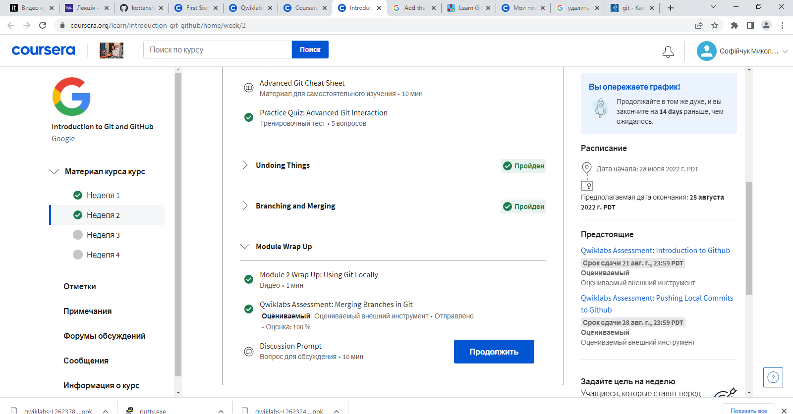  
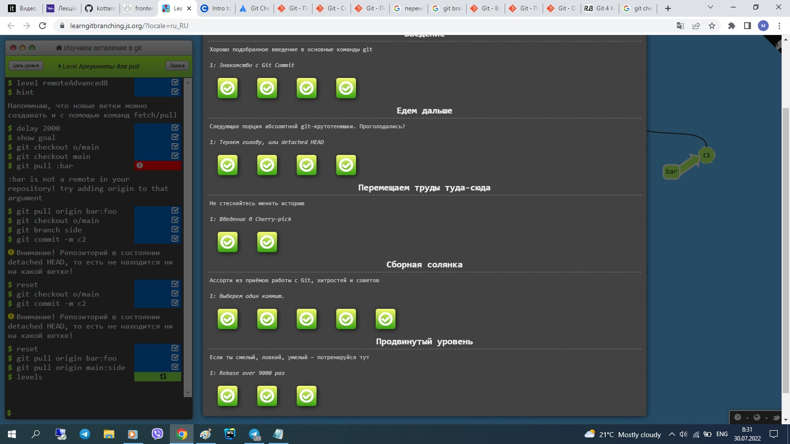
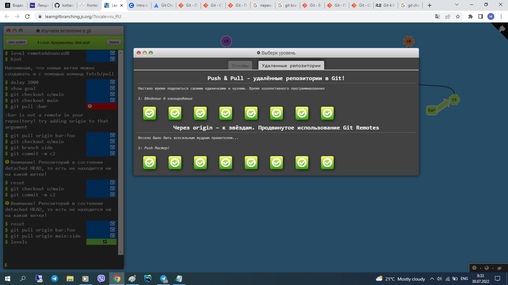
    

## Linux CLI and HTTP

  

  
notes
 
    
1) linux:  
-нового:   
-майже всі команди (до того використовував - при роботі з гітом - тільки cd та ls);  
-зрозумів, для чого git bash у окремому вікні - до того користувався тільки вбудованим у вебшторм. (покопався на своєму компі, використовуючи частину команд);  
-шо буду використовувати:  
-поки не знаю, бо полишати вінду поки не планую;  
-шо для роботи в IDE знадобиться;  

2) http:  
-різниця між аутентифікацією та авторизацією;  
-шо таке кукі;  
-постійне з'єднання і паралельне з'єднання;  
-base64;  
-термін придатності документів;  

  

    

  
pics

  

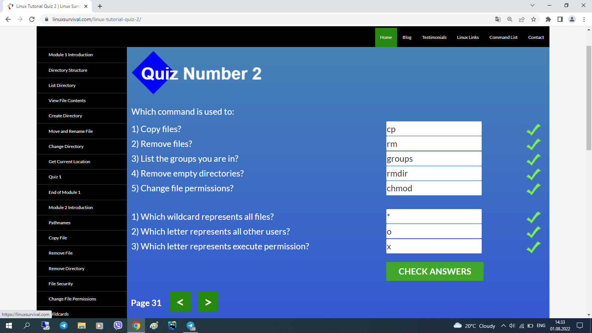
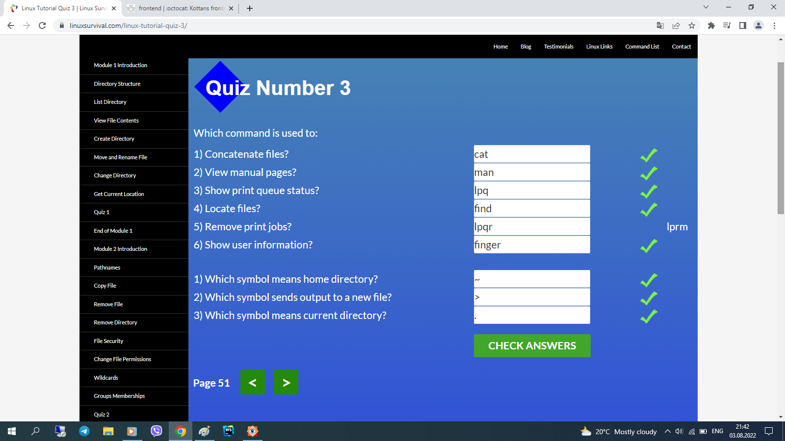
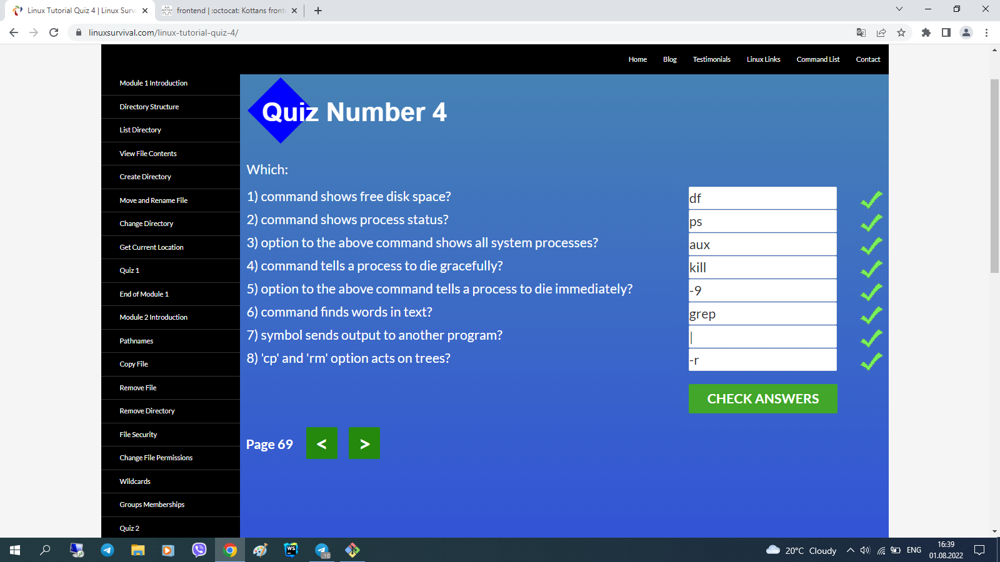
    

## Git Collaboration

  

  
notes
 
 
1) git collaboration:  
-git remote show origin;  
-git log -p -1;  
-(git remote update);  
-git commit -a -ammend;  
-using atom/nano;  
-ci/cd concept;  

2) learn git branching:  
-see chapter 1;  
    
  

    

 
  
pics

  
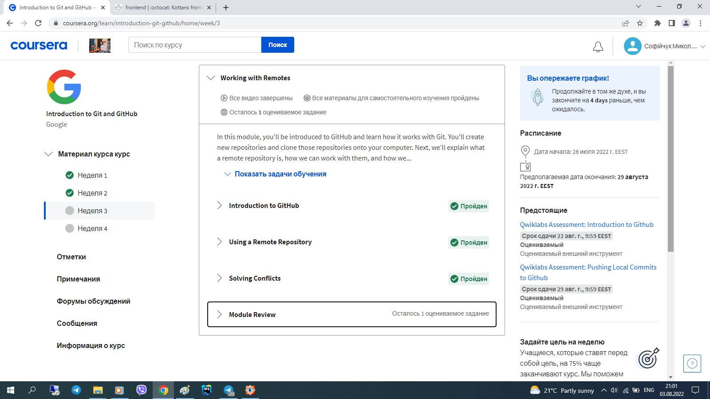
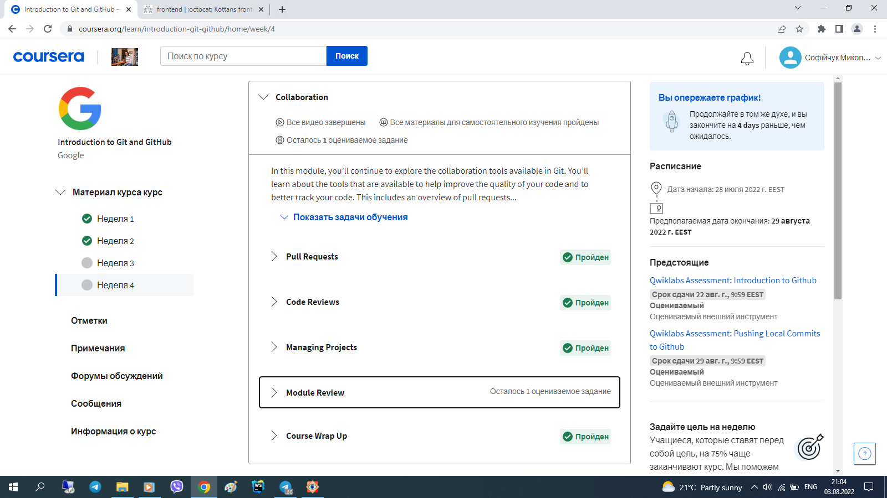
    

## Intro to HTML and CSS

  

  
notes
 
  
1) html at coursera:   
-html standart history;  
-caniuse;  
-7 types of elements in html5;  
-img size like placeholder ;  
-a is inline-block;  

2) css at coursera:  
-combining selectors rules;  
-few of pseudo-classes;  
-conflict resolution technicalities;  
-box-sizing: border-box;  
-body and * selector difference;  
-hints of work with dev tools;  
-floating;  

3) html at codeacademy:  
-using tab for indentation;    
-not to give up making too easy task;  
-tables are the ultimate evil itself;  
-boring and useful;  
-validation patterns;  

4) css at codeacademy:  
-(?) reference by attribute: [href] {}; img[src*='summer'] {} === attribute selectors;  
-10 border styles;  
-140 built-in color keywords;  
-shorthand=shortened;  
-overflow values;  
-the difference between display: none and visibility: hidden;  
-using sticky positioning for more then one child;  
-the z-index property does not work on static elements;  
-float is for static and relative positioned elements only;  

    

    

  
pics

  
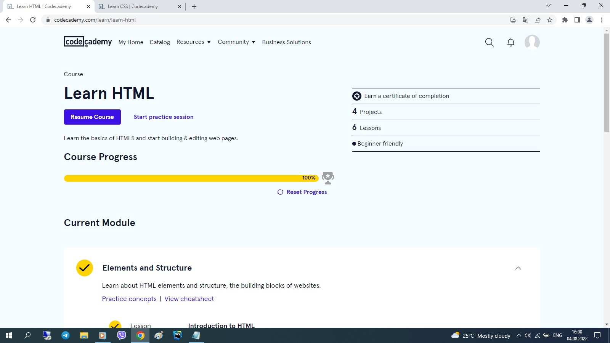
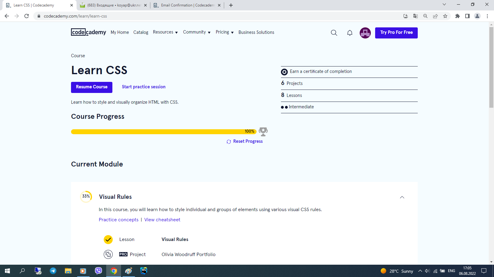
    

## Responsive Web Design

  

  
notes
 
    
1)  responsive design article:  
-meta name="viewport" content="width=device-width, initial-scale=1";  
-lighthouse;  
-img {max-width: 100%; display: block;};  
-using % for the widths of columns;  
-fr units for grid layout;  
-multicol layout;  
-classic readability theory: 8-10 words per line;  
-show media-query optionin dev tools;  
2)  flex vid:  
-inline-flex prop;  
-row to column on narrow screen;  
-using flex for header-main-footer scheme;   
3)   flex game:  
[had done flex froggy earlier];  
4)  grid vid:  
-autoprefixer;  
-grid vs inline-grid;  
-grid-template-rows/columns/areas;  
-% px fr;  
-minmax auto fit-content;  
-repeat;  
-grid-area;  
-shortened properties;  
-implicit and explicit elements;  
--- тут я поплив, бо раніше верстав або нормально, або на флексах. буду розбиратись в процесі практичного завдання --- верстаючи попап;  
5)  grid game:  
[did_that_grid_garden];  

  

    

  
pics

  
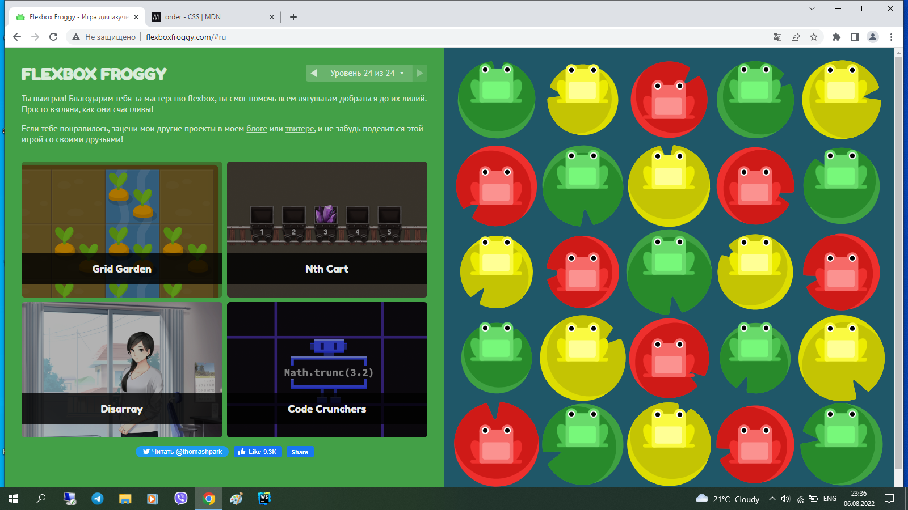
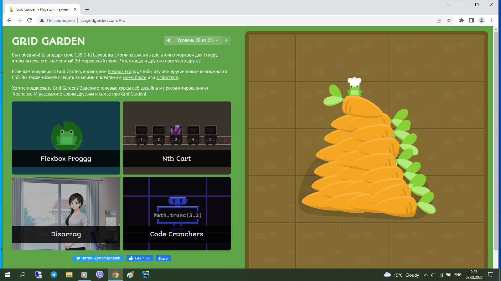
    

## HTML & CSS Practice

  
notes
 
  
some text will be here ASAP

 

  
demo

  
https://sofiichuk.github.io/pop-up-task/

