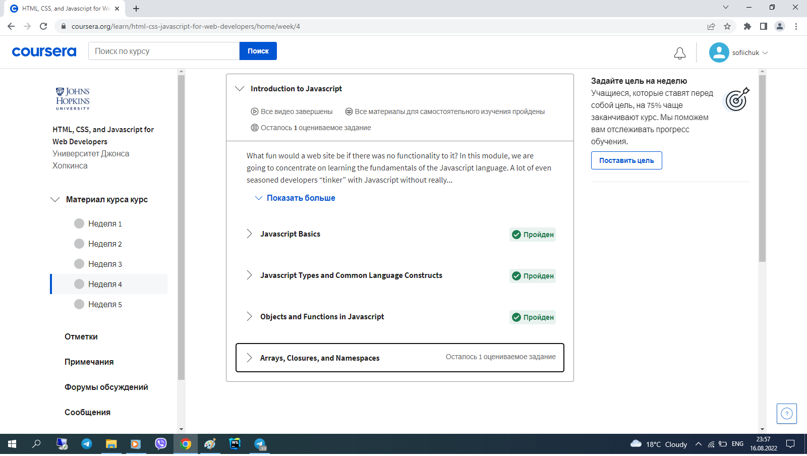
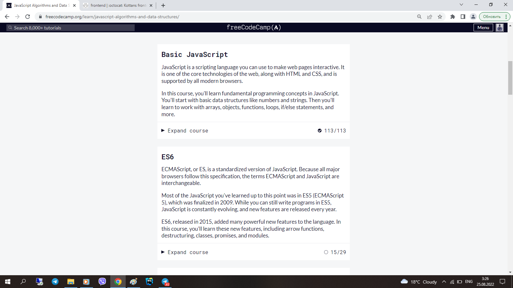
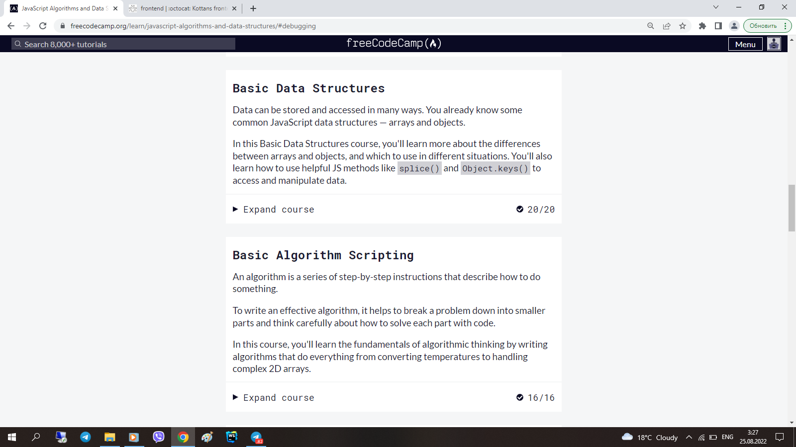
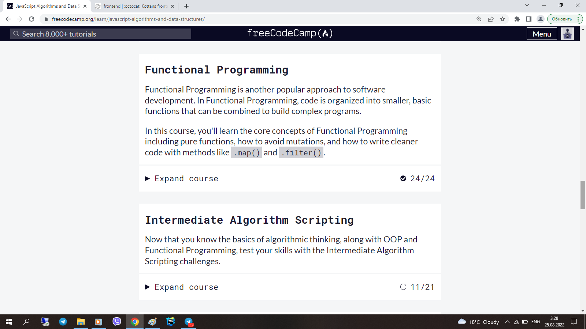
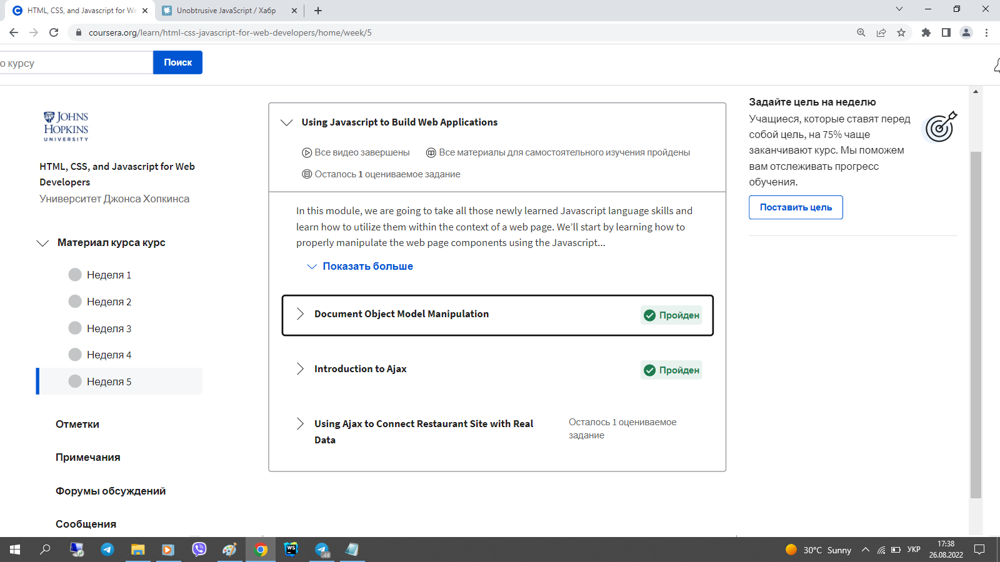
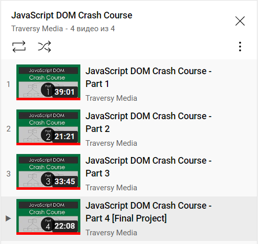
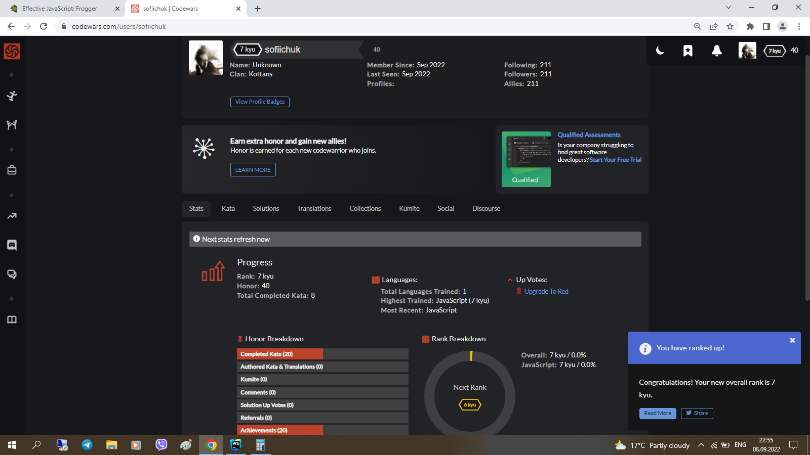

# kottans-frontend

hi there.  
it took about a week, but i did it: completed chapters 1-5.  
i don't have neither time, nor inspiration to set the whole report in a logical way.  
that's why i copy-paste my notes - fragmented as they are - and bind each part - along with screenshots - to the related chapter under cut.  

## Git Basics

  
notes
 
  
1) introduction to git:  
-version control before git (diff/patch);  
-using diff option in git and the days before git;  
-git log -p, git diff, git mv, git revert, git log --graph --oneline;  

2) learn git branching:  
--новиною-новиною було існування протоколів git:// та ssh://;  
--просто новиною:  
 -те, шо git pull - це fetch+merge - 2:1;  
 -те, шо можна совать вказівник (не хед і не мейн) по коммітах - git branch f-;   
 -те, шо у fetch бувають аргументи;  
 -видалення віддалених гілок через пуш без аргументу <джерело>;  
 -cherry-pick;  
 -те, шо HEAD буває detached;  
  -ше кілька новин було;  
--новим навиком - переміщення між коммітами, і переміщення коммітів (до того оперував тільки гілками, в межах котрих шось коммітив);  
--а використовувати у майбутньому, як показує моя кількамісячна практика, буду здебільшого таки операції з гілками, а не з коммітами;  

 

  
pics

  
  

    

## Linux CLI and HTTP

  

  
notes
 
    
1) linux:  
--нового:   
 -майже всі команди (до того використовував - при роботі з гітом - тільки cd та ls);  
 -зрозумів, для чого git bash у окремому вікні - до того користувався тільки вбудованим у вебшторм. (покопався на своєму компі, використовуючи частину команд);  
--шо буду використовувати:  
 -поки не знаю, бо полишати вінду поки не планую;  
 -шо для роботи в IDE знадобиться;  

2) http:  
-різниця між аутентифікацією та авторизацією;  
-шо таке кукі;  
-постійне з'єднання і паралельне з'єднання;  
-base64;  
-термін придатності документів;  

  

    

  
pics

  

    

## Git Collaboration

  

  
notes
 
 
1) git collaboration:  
-git remote show origin;  
-git log -p -1;  
-(git remote update);  
-git commit -a -ammend;  
-using atom/nano;  
-ci/cd concept;  

2) learn git branching:  
-see chapter 1;  
    
  

    

 
  
pics

  

    

## Intro to HTML and CSS

  

  
notes
 
  
1) html at coursera:   
-html standart history;  
-caniuse;  
-7 types of elements in html5;  
-img size like placeholder ;  
-a is inline-block;  

2) css at coursera:  
-combining selectors rules;  
-few of pseudo-classes;  
-conflict resolution technicalities;  
-box-sizing: border-box;  
-body and * selector difference;  
-hints of work with dev tools;  
-floating;  

3) html at codeacademy:  
-using tab for indentation;    
-not to give up making too easy task;  
-tables are the ultimate evil itself;  
-boring and useful;  
-validation patterns;  

4) css at codeacademy:  
-(?) reference by attribute: [href] {}; img[src*='summer'] {} === attribute selectors;  
-10 border styles;  
-140 built-in color keywords;  
-shorthand=shortened;  
-overflow values;  
-the difference between display: none and visibility: hidden;  
-using sticky positioning for more then one child;  
-the z-index property does not work on static elements;  
-float is for static and relative positioned elements only;  

    

    

  
pics

  

    

## Responsive Web Design

  

  
notes
 
    
1)  responsive design article:  
-meta name="viewport" content="width=device-width, initial-scale=1";  
-lighthouse;  
-img {max-width: 100%; display: block;};  
-using % for the widths of columns;  
-fr units for grid layout;  
-multicol layout;  
-classic readability theory: 8-10 words per line;  
-show media-query optionin dev tools;  
2)  flex vid:  
-inline-flex prop;  
-row to column on narrow screen;  
-using flex for header-main-footer scheme;   
3)   flex game:  
[had done flex froggy earlier];  
4)  grid vid:  
-autoprefixer;  
-grid vs inline-grid;  
-grid-template-rows/columns/areas;  
-% px fr;  
-minmax auto fit-content;  
-repeat;  
-grid-area;  
-shortened properties;  
-implicit and explicit elements;  
--- тут я поплив, бо раніше верстав або нормально, або на флексах. буду розбиратись в процесі практичного завдання --- верстаючи попап;  
5)  grid game:  
[did_that_grid_garden];  

  

    

  
pics

  

    

## HTML & CSS Practice

  
notes
 
  
acomplishing this task took a week - so as the previous 5 tasks did together. it made me realy angry, cause i had thought it would be easy peasy. but i found out what accordion is & how to make it on pure css. and also there were a bunch of smaller findings - unpopular rules of combining selectors, e.g. - and so on... definitly usefull

 

  
demo

  
https://sofiichuk.github.io/pop-up-task/

## JavaScript Basics

  
notes
 
  
1) js at courcera:  
  
-Boolean wrapper;  
-change by value/by reference;  
-constructor: global this, new, prototype;  
-stored in array function invocation - array[n]\();  
-for (var in);  
-some closure concept details;  
-fake namespaces;  
-IIFE & window as a prop & passing prop from func to the global scope;  
  
...scopes is definitly the hardest part (by now); 

2.1) basic javascript at freecodecamp:  
  
-/", /n, /t, // and so on;  
-arr[3][0][1] notation;  
-variables declared without keywords are automatically created in the global scope;  
-(?) when string2num and when num2string;  
-pseudocode;  
-function isEqual(a, b) {return a === b};  
-delete obj.prop;  
-nested arrays iteration with for loop: product * arr[i][j];  
-recursive function;  
-Math.floor(Math.random() * 10);  
-parseInt();  
  
...recursion is definitly the hardest part (by now);  
  
2.2) es6 challenges at freecodecamp:  
  
-Object.freeze();  
-Arr.reduce();  
-didn't know (...args) is called "the rest parameter";  
-spread operator vs rest operator;  
-object props rearragement using deconstruction - a bunch of;  
  
...it turned out i am used to the latest ES version;  
  
2.3) basic data structures at freecodecamp:  
  
-passing variable to array;  
-details of splice() & slice() methods;  
-indexOf==-1;  
-obj.hasOwnProperty('a')=='a' in obj;  
-Object.keys(obj);  
  
  ...ok;  
  
2.4) basic algorithm scripting at freecodecamp: 
  
-.repeat();  
-.substring();  
-.sort();  
  
...it was hard; 
  
2.5) functional programming at freecodecamp:  
  
-imperative/declarative;  
-lambda;  
-splice/slice diff;  
-4 props of .map();  
-object as a prop;  
-.map() doesn't mutate the array (although callbackFn may do so);  
-.reduce() and its 5 props;  
-Number wrapper;  
-.split();  
-.every();  
-.some();  
-learned a few more special symbols;  
  
...theory wasn't that new, though many details were;  
  
2.6) intermediate algorithm scripting at freecodecamp:  
  
-the arguments object;  
-.charAt(0);  
-iteration through a string;  
-RegEx; 
  
...though at first i was really enjoing making functions by myself (each one was a small victory), closer to the end i got really tired of that - tired as hell; 
  
...but the final result is - js is not that scary anymore; 
  

 

  
pics

  

## Document Object Model

  
notes
 
  
1)dom manipulation at coursera:   
-unobtrusive event binding;   
-this.textContent='';   
-'DOMContentLoaded' prop;   
-if(event1){event2};    
...had known most of that;    
  
2)intermediate algorithm scripting at freecodecamp:   
...no news - is good news (though it was hard as hell);   
  
3)vanilla js article:   
-getElement & querySelector differ when it's about dynamic page mutations;    
...and a bunch of more news - evidently, most of them re-appears in 8.4 - when re-spoken;   
  
4)javascript dom crash course lectures:   
-obj.style.prop;    
-childs (e.g. li) form an array;    
-nth-child selector (just like in css);   
-item.parentNode.parentNode.parentNode;   
-parentNode===parentElement;    
-.childNode displays '[i]text' for spaces, so .children should be preffered;    
-and thus .firstElementChild > .firstChild;   
-nextSibling, previousSibling;    
-el.setAttribute('name','value');   
-newDiv.appendChild(document.createTextNode('text'));     
-container.insertBefore(newDiv,existingElement);   
-client/offset x&y;   
-e.target, e.type, e.x, e.target.value, e.target.style, e.target.id;    
-e.preventDefault();    
-if(e.target.classList.contains('class'));    
...learned a lot of new ways to interact with dom elements;   
    
5)practice - interactive side menu:   
...done.    
    

 

  
pics & demo

      
https://sofiichuk.github.io/dom-task/     
    
      
    
    
      

    

## Building a Tiny JS World (pre-OOP):    
    

 
notes
 
    
-figured out object.values/keys/entries(obj) don't guarantee a propper order;   
-figured out what an infinite loop is;    
-for the first time nested arr.map into arr.map;    

 

  
demo

      
https://sofiichuk.github.io/a-tiny-JS-world/  
    
## Object oriented JS

  
notes
 
     
1)lecture on OOP at youtube pt.1:   
-class SomeClass {    
 constructor(prop){   
 this.smth=prop   
 }    
 method(){}   
 };   
-let copy=new SomeClass;    
-prototype methods are inserted functions;    
-invokation - copy.method();    
-class SomeClass2 extends class SomeClass{    
 constructor(...prop, newProp){   
 super(...prop);    
 this.newProp=newProp;    
}   
};    
-let copy2=new SomeClass2;    
-constructor is a func invoked when new obj (new SomeClass) is created;   
-__proto__;   
    
2)lecture on OOP at youtube pt.2:   
-let user2={};    
 user2.__proto__=user;    
 ||   
 Object.setPrototypeOf(user2,user);   
-setter&getter;   
-user2.username Vs. user2.__proto__.username;   
    
3)classic frogger game:   
...still in progress;   
    
4)codewars:   
..it was easier then freecodecamp;    
    
 

  
pics & demo

        
https://... (once ready, frogger game demo will be here) 
      

    

    
