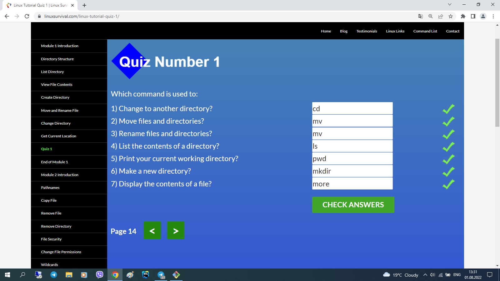

# kottans-frontend

hi, there.  
it took about a week, but i did it: completed chapters 1-5.  
i don't have neither time, nor inspiration to set the whole report in a logical way.  
that's why i copy-paste my notes - fragmented as they are - and bind each part - along with screenshots - to the referent chapter under cut - so one can see i did it by myself ('cause thats the point, i guess?!)

## Git Basics

1)-version control before git (diff/patch);
-using diff option in git and the days before git;
-git log -p, git diff, git mv, git revert, git log --graph --oneline;

2)новиною-новиною було існування протоколу git://, а відтак - і ssh://;

просто новиною:
- те, шо git pull - це fetch+merge - 2:1;
- те, шо можна совать вказівник (не хед і не мейн) по коммітах - git branch f-; 
- те, шо у fetch бувають аргументи;
- видалення віддалених гілок через пуш без аргументу <джерело>;
- cherry-pick;
- те, шо HEAD буває detached;
- ше кілька новин було;

новим навиком - переміщення між коммітами, і переміщення коммітів (до того оперував тільки гілками, в межах котрих шось коммітив);

а використовувати у майбутньому, як показує моя кількамісячна практика, буду здебільшого таки операції з гілками, а не з коммітами;

  
Git Basics
  
  
  
    

## Linux CLI and HTTP

1)
 нового: 
- майже всі команди (до того використовував - при роботі з гітом - тільки cd та ls);
- зрозумів, для чого git bash у окремому вікні - до того користувався тільки вбудованим у вебшторм. (покопався на своєму компі, використовуючи частину команд);
 
 шо буду використовувати:
- поки не знаю, бо полишати вінду поки не планую: шо для роботи в IDE знадобиться...;

2)
різниця між аутентифікацією та авторизацією;
шо таке кукі;
постійне з'єднання і паралельне з'єднання;
base64;
термін придатності документів;

  
Linux CLI and HTTP

  

    

## Git Collaboration

- git remote show origin;
-git log -p -1;
-(git remote update);
-git commit -a -ammend;
-using atom/nano;
-ci/cd concept;

 
  
Git Collaboration

  

    

## Intro to HTML and CSS

1.1)
html standart history;
caniuse;
7 types of elements in html5;
img size like placeholder ;
a is inline-block;

1.2)
combining selectors rules;
few of pseudo-classes;
conflict resolution technicalities;
box-sizing: border-box;
body and * selector difference;
hints of work with dev tools;
floating;

2) using tab for indentation;
not to give up making too easy task;
tables are the ultimate evil itself;
boring and useful;
validation patterns;

3) (?) reference by attribute: [href] {}; img[src*='summer'] {} === attribute selectors;
10 border styles;
140 built-in color keywords;
shorthand=shortened;
overflow values;
the difference between display: none and visibility: hidden;
using sticky positioning for more then one child;
the z-index property does not work on static elements;
float is for static and relative positioned elements only;

  
Intro to HTML & CSS

  

    

## Responsive Web Design

5.1
-<meta name="viewport" content="width=device-width, initial-scale=1">;
-lighthouse;
-img {max-width: 100%; display: block;};
-using % for the widths of columns;
-fr units for grid layout;
-multicol layout;
-classic readability theory: 8-10 words per line;
-show media-query optionin dev tools;
5.2
-inline-flex prop;
-row to column on narrow screen;
-using flex for header-main-footer scheme; 
5.3 
[had done flex froggy earlier];
5.4
-autoprefixer;
-grid vs inline-grid;
-grid-template-rows/columns/areas;
-% px fr;
-minmax auto fit-content;
-repeat;
-grid-area;
-shortened properties;
-implicit and explicit elements;
--- тут я поплив, бо раніше верстав або нормально, або на флексах. буду розбиратись в процесі практичного завдання --- верстаючи попап;
5.5
[did_that_grid_garden];

  
Responsive Web Design

  

    

